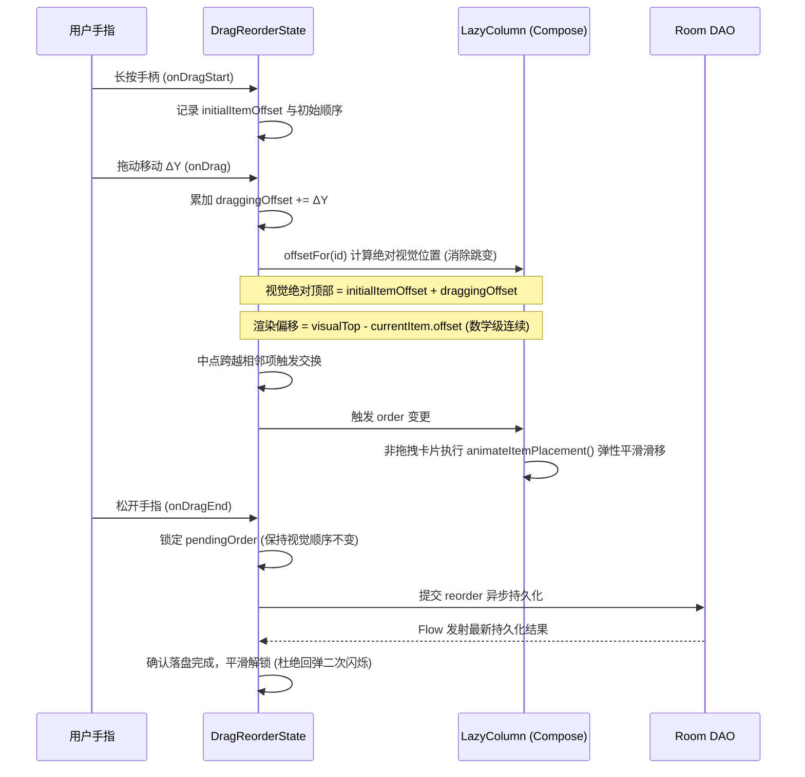
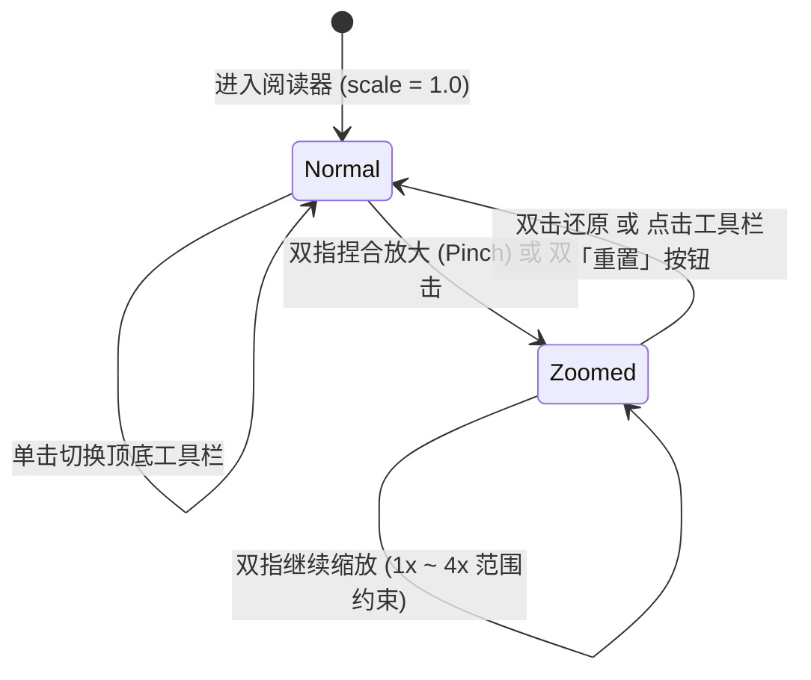

# 漫流架构设计文档

本文档全面梳理漫流（Manliu）的整体软件工程架构、模块交互流、核心算法状态机与关键技术选型，供开发与协同人员深入理解。

---

## 1. 架构总览

漫流采用**单 Activity + 模块化 Jetpack Compose UI + 单例 Repository + Room 数据库 + 前台服务持久化**的分层架构：

```
┌─────────────────────────────────────────────────────────────────┐
│                           UI 层 (ui/)                           │
│  MainActivity.kt (轻量入口：enableEdgeToEdge 沉浸式设置与顶层 Scaffold 路由) │
│  ┌─────────────────┐  ┌──────────────────┐  ┌────────────────┐  │
│  │  LibraryScreen  │  │   AlbumScreen    │  │  ReaderScreen  │  │
│  │   (图库首页)    │  │  (图集图片管理)  │  │ (沉浸条漫阅读) │  │
│  └─────────────────┘  └──────────────────┘  └────────────────┘  │
│  FolderImportDialog · ProgressCards · Theme/Color · 手势缩放引擎 │
├─────────────────────────────────────────────────────────────────┤
│                          交互与算法层                            │
│  ┌───────────────────────┐  ┌────────────────────────────────┐  │
│  │  DragReorderState     │  │  ImageSorting                  │  │
│  │  (长按拖拽防抖状态机) │  │  (自然文件名排序: 2 排在 10 前)│  │
│  └───────────────────────┘  └────────────────────────────────┘  │
│  ┌───────────────────────┐  ┌────────────────────────────────┐  │
│  │  ImportOrdering       │  │  ReaderProgress                │  │
│  │  (失败重试原位插入)   │  │  (稳定图片 ID 进度定位)        │  │
│  └───────────────────────┘  └────────────────────────────────┘  │
├─────────────────────────────────────────────────────────────────┤
│                          服务与后台层                           │
│  ┌───────────────────────────────┐  ┌────────────────────────┐  │
│  │  ImportService                │  │  ArchiveService        │  │
│  │  (前台服务：多选/大图集/ZIP)  │  │  (前台服务：备份导出还原)│  │
│  └───────────────────────────────┘  └────────────────────────┘  │
├─────────────────────────────────────────────────────────────────┤
│                          核心业务层                             │
│  ┌───────────────────────────────────────────────────────────┐  │
│  │                 ComicRepository (单例仓库)                │  │
│  │  图集管理 · 图片暂存复制 · ZIP解压流 · 事务管理 · 空间预检 │  │
│  └───────────────────────────────────────────────────────────┘  │
│  ┌───────────────────────────────┐                              │
│  │  ArchiveManager               │                              │
│  │  (先验后写备份与还原引擎)     │                              │
│  └───────────────────────────────┘                              │
├─────────────────────────────────────────────────────────────────┤
│                          持久化与存储                           │
│  ┌───────────────────────────────────────────────────────────┐  │
│  │  ComicDatabase (Room SQLite)                              │  │
│  │  albums · pages · import_jobs · import_items              │  │
│  └───────────────────────────────────────────────────────────┘  │
│  应用私有目录文件存储：                                          │
│  - filesDir/albums/{albumId}/*.jpg (正式图片)                   │
│  - filesDir/import-staging/{uuid}/* (暂存解包目录)              │
│  - filesDir/restore-staging/{uuid}/* (恢复暂存目录)             │
└─────────────────────────────────────────────────────────────────┘
```

---

## 2. 模块化 UI 层设计

项目在重构后消除了单一巨石文件的坏味道，采用清晰的职责隔离：

```
app/src/main/java/com/kelele/manliu/
├── MainActivity.kt                # 顶层宿主 Activity：enableEdgeToEdge 沉浸式与 Scaffold 路由
└── ui/
    ├── theme/
    │   ├── Color.kt               # 品牌色 (Accent)、米白背景与纯黑阅读模式 (ReaderBackgroundDark)
    │   └── Theme.kt               # ManliuTheme 统一主题包装
    ├── components/
    │   └── ProgressCards.kt       # 导入 (ImportProgressCard) 与归档 (ArchiveProgressCard) 进度卡片
    ├── library/
    │   └── LibraryScreen.kt       # 图库网格、新建图集、备份与恢复弹窗、平滑拖拽排序
    ├── album/
    │   ├── AlbumScreen.kt         # 图片排序、批量选择删除、从文件夹/相册/ZIP导入弹窗
    │   └── FolderImportDialog.kt  # 文件夹多选预览、全选与异步排序导入对话框
    └── reader/
        └── ReaderScreen.kt        # 沉浸条漫阅读器：手势缩放、derivedStateOf 防重组、PageIndicator 与纯黑模式
```

---

## 3. 核心机制详解

### 3.1 长按手动排序防闪动算法（`DragReorderState`）

长按排序曾因项交换时单帧位移基准跳变而产生剧烈抽搐。现已重构成一套**连续相对位移补偿状态机**：



**关键设计点**：
1. **渲染偏移连续性**：不直接拿动态变化的 `(dragTop - item.offset)` 算，而是以长按初始点为基准计算 `(initialItemOffset + draggingOffset - currentItem.offset)`。当项在底层被测量重排时，这一差值动态自动抵消，卡片在屏幕上的绝对物理位置实现 0 跳跃；
2. **物理让位动画**：非拖拽卡片绑定 `Modifier.animateItemPlacement(animationSpec = spring(...))`，被挤开的卡片像水流般自然滑开；
3. **松手防闪回锁**：在 Room 真正发射新列表之前锁定临时 `order`，彻底消除了松手时卡片先弹回旧位置再闪到新位置的现象。

---

### 3.2 连续条漫阅读器手势交互系统

针对条漫分镜和台词需要放大细看的需求，`ReaderScreen` 实现了多层手势变换体系：



* **常亮机制**：通过 `DisposableEffect(LocalView.current)` 在进入阅读器时绑定 `keepScreenOn = true`，退出自动释放；
* **纯黑背景模式**：提供 AMOLED 纯黑 (`#000000`) 与米白 (`#FAF8F4`) 一键切换，夜间阅读更舒适。

#### Compose 重组优化策略

阅读器中的手势状态（`scale`、滚动位置）属于高频变化值，直接在 Composable 作用域中读取会导致灾难性的全量重组。v0.4.1 采用以下隔离策略：

| 问题场景 | 优化手段 | 效果 |
|----------|----------|------|
| 双指缩放时 `scale` 每帧变化 | `derivedStateOf { scale > 1.05f }` 派生 `isZoomed`/`isScrollEnabled` | 仅在跨越阈值时重组，缩放过程中零重组 |
| 滚动时 `firstVisibleItemIndex` 持续变化 | 提取独立 `PageIndicator` Composable + `derivedStateOf` | 页码变化只触发指示器局部重组，不影响控制栏 |
| `Flow` 在应用后台时仍持续收集 | 全局替换为 `collectAsStateWithLifecycle` | 应用退到后台自动停止收集，节省资源 |

---

### 3.3 Coil 大图下采样与列表流畅度保护

条漫原图通常是单张数十兆、数万像素的高清长图。在图库封面（`82dp x 104dp`）和图集图片列表（`66dp x 86dp`）中，若全尺寸解码会瞬间撑爆应用内存。
* **方案**：在 `AsyncImage` 中显式配置 `coil.request.ImageRequest.Builder` 的采样尺寸约束：
  ```kotlin
  ImageRequest.Builder(LocalContext.current)
      .data(repository.imageFile(page))
      .size(198, 258) // 按 3x 像素密度下采样解码
      .crossfade(true)
      .build()
  ```
* 解码器在读取时按比例跳跃式解码，内存占用降低 90% 以上，滑动保持满帧率。

---

### 3.4 ZIP / CBZ 漫画压缩包导入引擎

在 `ComicRepository` 中增加了通用的 `createArchiveImport` 管道：
1. **流式读取**：使用 `ZipInputStream` 边读边解，避免一次性在内存中解压超大包；
2. **智能过滤**：自动排除 `__MACOSX`、`.DS_Store`、隐藏文件与非图片资源；
3. **自然排序**：解压出的图片条目通过 `compareImageNames` 执行自然数字排序（确保 `1.png -> 2.jpg -> 10.jpg`）；
4. **复用前台导入服务**：解压暂存后直接构造 `status = QUEUED` 的 `ImportJob`，复用成熟的断点续传、失败重试、取消与通知栏进度展示机制。

---

## 4. 自动化测试体系

当前测试集包含 **13 项纯 JVM 单元测试**（不依赖昂贵耗时的模拟器）：

```
app/src/test/java/com/kelele/manliu/
├── ArchiveLimitsTest.kt     # 5 项：测试备份图集数、图片数、清单尺寸及单图大小限制
├── ImportOrderingTest.kt    # 4 项：测试重试插入位置、暂停恢复续传、新任务追加逻辑
├── ReaderProgressTest.kt    # 2 项：测试跨页新增后阅读位置维持、页面列表刷新
└── ArchiveParserTest.kt     # 2 项：测试 ZIP/CBZ 条目过滤、垃圾文件排除及乱序自然排序
```

---

## 5. 核心设计原则

1. **纯净离线**：不申请网络权限，不建立外部连接，所有数据私密驻留本机；
2. **数据防御**：所有多表增删排操作均在 `withTransaction` 中执行；备份导出坚持“先验后写”；
3. **平滑连续**：UI 动效以物理弹簧（Spring）为准则，杜绝画面突变跳跃；
4. **渐进式容错**：长耗时任务支持随时暂停、取消与失败项针对性重试；
5. **Compose 重组隔离**：高频手势状态（缩放值、滚动索引）通过 `derivedStateOf` 和组件提取隔离，禁止在高层作用域直接读取易变状态；
6. **生命周期感知**：所有 UI 层的 Flow 收集均使用 `collectAsStateWithLifecycle`，后台自动停止收集；
7. **构建安全**：Release 构建强制启用 R8 混淆与资源压缩，防止逆向并优化包体积。
